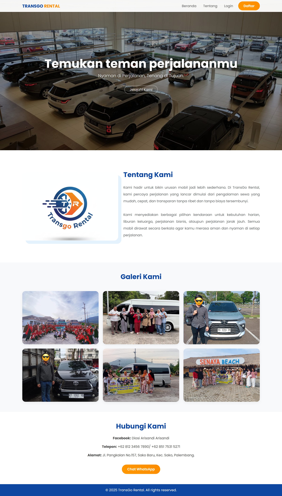
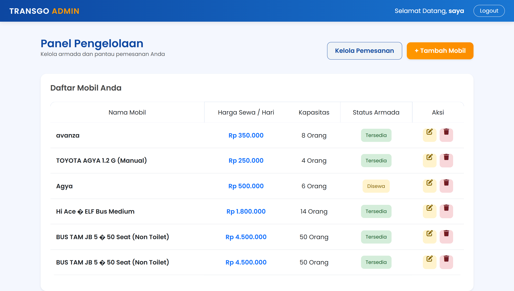
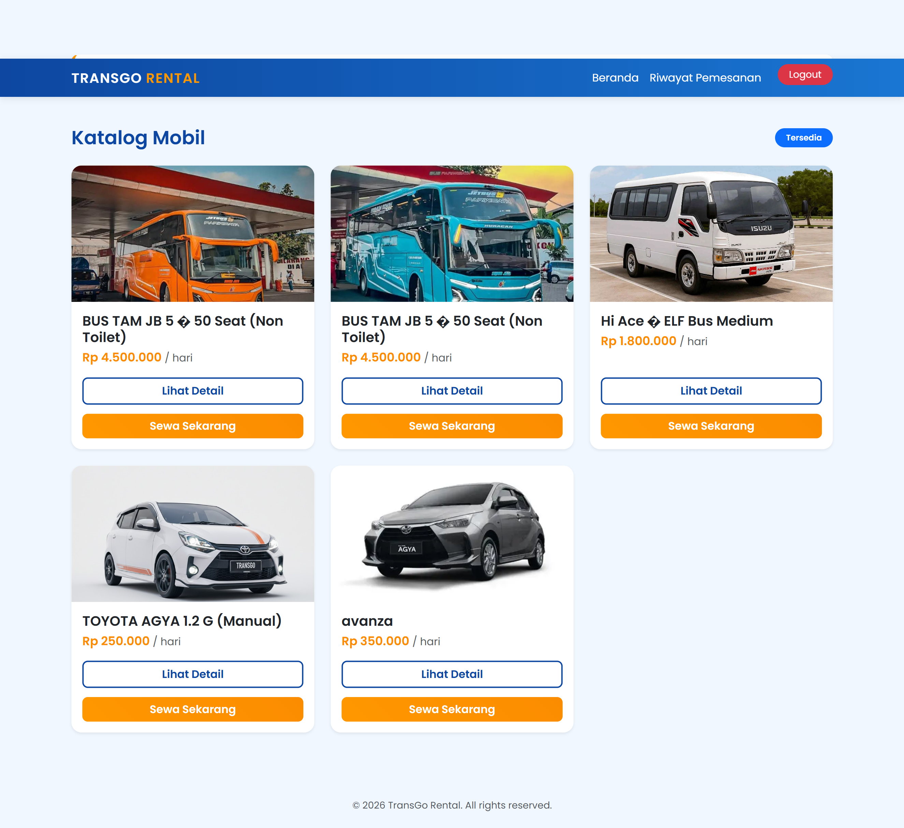
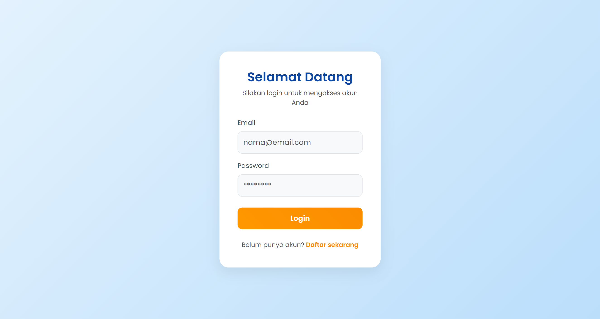
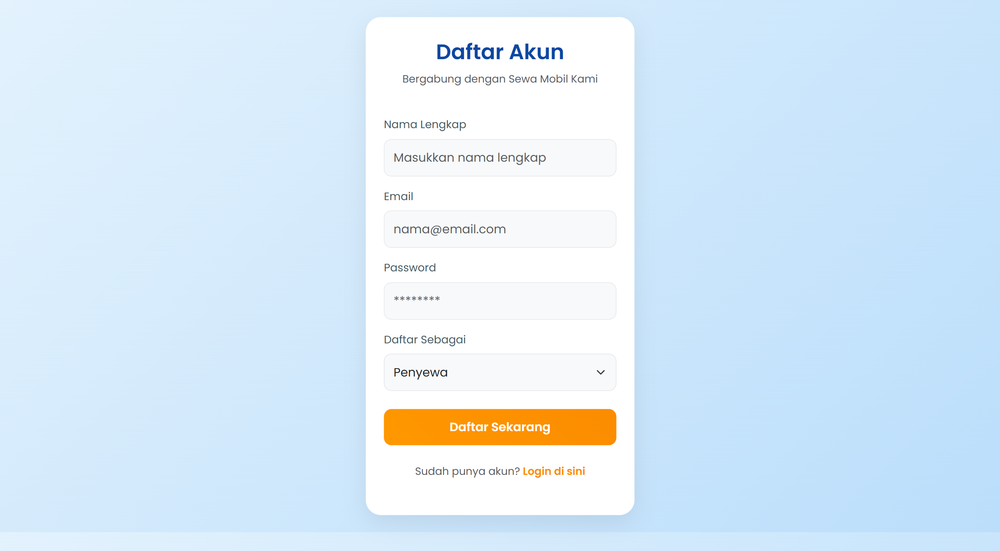
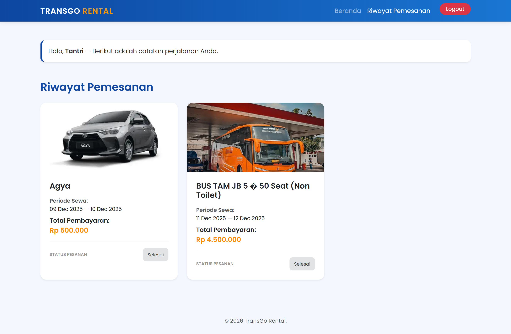
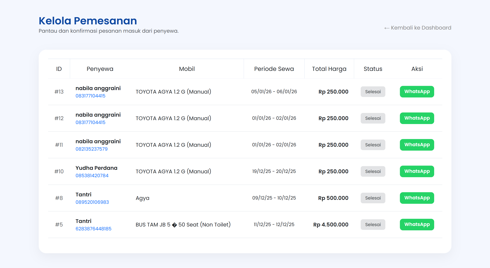
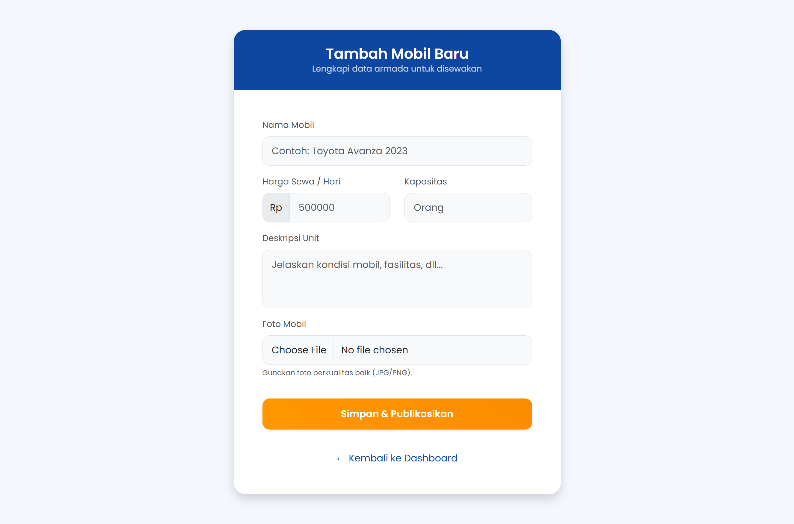

# SewaKendaraan Online - Platform Digital UMKM

**SewaKendaraan Online** adalah sebuah platform berbasis web yang dirancang untuk memudahkan pemilik kendaraan mendaftarkan armada mereka (motor/mobil) agar bisa disewakan secara lebih luas melalui sistem online. 

Web ini berfungsi sebagai wadah digital bagi para pelaku usaha penyewaan kendaraan untuk menjangkau penyewa dengan lebih mudah, cepat, dan terorganisir.

---

### 🚀 Fitur Utama:
* **Pendaftaran Kendaraan:** Pemilik dapat mengunggah detail kendaraan, foto, dan harga sewa.
* **Manajemen Admin:** Halaman khusus untuk mengelola daftar kendaraan dan melihat pesanan yang masuk.
* **Katalog Produk (Shop):** Tampilan kendaraan yang tersedia bagi calon penyewa.
* **Dashboard Informatif:** Ringkasan data penyewaan untuk pemilik usaha.

link website https://transgorental.infinityfreeapp.com/?i=1

---
*Dibuat untuk mendukung digitalisasi UMKM di bidang transportasi.*

# Dokumentasi Tampilan Web UMKM

### 1. Halaman Beranda

### 2. Halaman Dashboard Admin

### 3. Halaman Penyewa

### 4. Halaman Login

### 5. Halaman Register

### 6. Halaman riwayat penyewa

### 7. Halaman kelola pesanan

### 8. Halaman Tambah mobil

